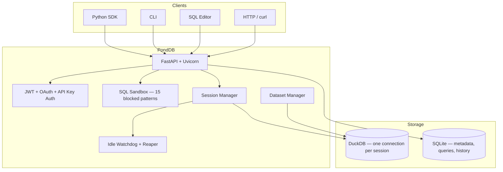

<p align="center">
  <picture>
    <source media="(prefers-color-scheme: dark)" srcset="https://raw.githubusercontent.com/pond-db/pond-db/main/.github/logo-dark.svg">
    <source media="(prefers-color-scheme: light)" srcset="https://raw.githubusercontent.com/pond-db/pond-db/main/.github/logo-light.svg">
    
  </picture>
</p>

<p align="center">
  <b>Serverless DuckDB platform with async HTTP query API, workgroup isolation, and OAuth — self-hosted.</b>
</p>

<p align="center">
  <a href="https://github.com/pond-db/pond-db/actions/workflows/ci.yml"></a>
  
  
  <a href="LICENSE"></a>
  
</p>

[](https://github.com/pond-db/pond-db/actions/workflows/ci.yml)

<p align="center">
  <a href="docs/api.md">API Reference</a> ·
  <a href="ARCHITECTURE.md">Architecture</a> ·
  <a href="docs/configuration.md">Configuration</a> ·
  <a href="CONTRIBUTING.md">Contributing</a> ·
  <a href="CHANGELOG.md">Changelog</a>
</p>

---

## What is PondDB?

PondDB turns DuckDB into a multi-tenant serverless platform. Submit SQL over HTTP, get results back — no connections to manage, no clusters to provision, no cold starts. Think Redshift Serverless, but open-source and self-hosted.

## Features

| Feature | Description |
|---------|-------------|
| **PondAPI** | Async HTTP query execution. POST SQL, poll for results. Sub-200ms submission. |
| **Workgroup Isolation** | Per-team compute quotas, session limits, and data isolation. |
| **Session Lifecycle** | Auto-suspend idle sessions, transparent resume, zero cold starts. |
| **OAuth + Invite System** | Google & GitHub SSO. Invite-gated registration with role assignment. |
| **SQL Editor** | Browser-based CodeMirror 6 editor with live schema sidebar. |
| **SQL Sandbox** | 15 blocked patterns prevent file access, config changes, and extension loading. |
| **Dataset Manager** | Upload CSV/Parquet → auto-registered as DuckDB tables across all sessions. |
| **Query Store** | Save, name, share. Public slugs at `/q/{slug}` with per-IP rate limiting. |
| **Python SDK** | `pip install ponddb` — authenticate, query, save, share in 5 lines. |
| **CLI** | `pond serve`, `pond version`, `pond check` — everything from the terminal. |
| **Self-Hosted** | Single `docker compose up`. Your hardware, your data, no vendor lock-in. |

## How PondDB compares

|  | DuckDB | Redshift Serverless | PondDB |
|--|--------|---------------------|--------|
| **Type** | Embedded engine | Cloud service | Self-hosted platform |
| **Multi-tenant** | No | Yes | Yes |
| **HTTP API** | No | Yes (Data API) | Yes (PondAPI) |
| **Auth** | N/A | IAM | OAuth + JWT + API keys |
| **Cold start** | N/A | ~1 s | < 500 ms |
| **Self-hosted** | Yes (embedded) | No | Yes (Docker) |
| **Price** | Free | Pay per query | Free (OSS) |

> **DuckDB is the engine. PondDB is the platform.**
> PondDB wraps DuckDB in the infrastructure teams actually need — auth, isolation, HTTP APIs, a UI — so you can ship analytics without building all of that yourself.

## Quickstart

### 1. Clone and configure

```bash
git clone https://github.com/pond-db/pond-db.git
cd pond-db
cp .env.example .env
# Edit .env — set POND_API_KEY and POND_JWT_SECRET (at minimum)
```

### 2. Start the server

```bash
docker compose up -d
```

Or with pip (development):

```bash
pip install ponddb
uvicorn ponddb.app:app --host 0.0.0.0 --port 8432
```

### 3. Verify

```bash
curl http://localhost:8432/health
# → {"status": "ok", "version": "0.1.0", "sessions": 0}
```

### 4. Query from Python

```python
from ponddb import PondDB

client = PondDB("http://localhost:8432", api_key="your-api-key")

with client as session:
    result = session.query("SELECT 42 AS answer")
    print(result.rows)  # [[42]]
```

### 5. Or use curl

```bash
# Get a JWT
TOKEN=$(curl -s -X POST http://localhost:8432/auth/token \
  -H "Content-Type: application/json" \
  -d '{"api_key": "your-api-key"}' | jq -r .access_token)

# Create a session
SID=$(curl -s -X POST http://localhost:8432/session | jq -r .session_id)

# Run a query
curl -s -X POST http://localhost:8432/query \
  -H "Authorization: Bearer $TOKEN" \
  -H "Content-Type: application/json" \
  -d "{\"session_id\": \"$SID\", \"sql\": \"SELECT 42 AS answer\"}"
# → {"columns": ["answer"], "rows": [[42]], "rowcount": 1, "elapsed_ms": 1.2}
```

## Architecture



### Session lifecycle

```
COLD → ACTIVE → SUSPENDED → DESTROYED
```

```
POST /session         query arrives           idle timeout         max age / DELETE
     │                     │                      │                     │
     ▼                     ▼                      ▼                     ▼
COLD/NEW ──► ACTIVE ◄──────── SUSPENDED ──────────► DESTROYED
                │         transparent resume              ▲
                └─────────────────────────────────────────┘
```

- **COLD → ACTIVE**: `POST /session` spins up a DuckDB connection (< 500 ms)
- **ACTIVE → SUSPENDED**: Watchdog suspends after `POND_IDLE_TIMEOUT` seconds (default 300)
- **SUSPENDED → ACTIVE**: Next query triggers transparent resume — datasets re-registered automatically
- **ANY → DESTROYED**: `DELETE /session/{id}`, max age exceeded, or reaper cleanup

## API Reference

### Core endpoints

| Method | Path | Auth | Description |
|--------|------|------|-------------|
| `GET` | `/health` | — | Server status, version, session count |
| `POST` | `/session` | — | Create a DuckDB session |
| `DELETE` | `/session/{id}` | — | Destroy a session |
| `GET` | `/sessions` | — | List all sessions |
| `POST` | `/query` | JWT | Execute SQL synchronously |
| `GET` | `/schema` | JWT | Table and column introspection |
| `GET` | `/history` | JWT | Query execution history |
| `GET` | `/metrics` | — | Prometheus-compatible metrics |

### PondAPI (async execution)

| Method | Path | Auth | Description |
|--------|------|------|-------------|
| `POST` | `/pondapi/execute` | JWT | Submit SQL for async execution |
| `GET` | `/pondapi/execute/{id}/result` | JWT | Poll execution result |

### Auth

| Method | Path | Description |
|--------|------|-------------|
| `POST` | `/auth/token` | Exchange API key for JWT access + refresh tokens |
| `POST` | `/auth/refresh` | Refresh an expired access token |
| `POST` | `/auth/revoke` | Revoke a token |

### Data

| Method | Path | Auth | Description |
|--------|------|------|-------------|
| `POST` | `/datasets` | API Key | Upload CSV or Parquet file |
| `GET` | `/datasets` | API Key | List uploaded datasets |
| `DELETE` | `/datasets/{name}` | API Key | Delete a dataset |
| `POST` | `/catalog/mount` | JWT | Mount a local file path as a DuckDB table |
| `POST` | `/queries` | JWT | Save a named query |
| `GET` | `/queries` | JWT | List saved queries |
| `GET` | `/q/{slug}` | — | Execute a shared query (public link) |
| `GET` | `/editor` | — | Browser-based SQL editor |

### Admin

| Method | Path | Description |
|--------|------|-------------|
| `POST` | `/namespaces` | Create a namespace |
| `POST` | `/workgroups` | Create a workgroup with compute quota |
| `POST` | `/invites` | Generate an invite token |
| `POST` | `/invites/{token}/accept` | Accept an invite |

Full reference: [`docs/api.md`](docs/api.md)

## Configuration

Copy [`.env.example`](.env.example) and set at minimum:

| Variable | Required | Default | Description |
|----------|----------|---------|-------------|
| `POND_API_KEY` | ✅ | — | Master API key for authentication |
| `POND_JWT_SECRET` | ✅ | — | HS256 signing secret (≥ 16 chars) |
| `POND_WEBSITE_SESSION_SECRET` | ✅ | — | Cookie signing secret for the dashboard |
| `POND_HOST` | | `0.0.0.0` | Server bind address |
| `POND_PORT` | | `8432` | Server listen port |
| `POND_IDLE_TIMEOUT` | | `300` | Seconds before an idle session is suspended |
| `POND_MAX_SESSION_AGE` | | `86400` | Max session lifetime in seconds |
| `POND_DATA_ROOT` | | `./data` | Root directory for uploaded datasets |
| `POND_MAX_RESULT_MB` | | `100` | Maximum query result size in MB |
| `POND_SESSION_MEMORY_LIMIT` | | `2GB` | DuckDB memory limit per session |
| `POND_LOG_LEVEL` | | `INFO` | Logging level (DEBUG, INFO, WARNING, ERROR) |
| `POND_SQLITE_PATH` | | `./ponddb.db` | Path to the SQLite metadata database |

Run `pond check` to validate your environment. See [Configuration docs](docs/configuration.md) for the full variable reference.

## Development

```bash
git clone https://github.com/pond-db/pond-db.git
cd pond-db
python3 -m venv .venv && source .venv/bin/activate
pip install -e ".[dev]"

pytest                              # 2,552 tests
pytest tests/test_browser.py -v     # Playwright browser tests
ruff check src/ tests/              # Lint

# Generate demo data and run the full demo
python scripts/demo_data.py
python scripts/demo.py --api-key=your-key
```

## Project structure

```
pond-db/
├── src/ponddb/           # Application code (33 modules)
│   ├── app.py            # FastAPI app, routers, lifespan
│   ├── session_manager.py# DuckDB session pool + watchdog
│   ├── jwt_auth.py       # JWT, API key, OAuth, cookie auth
│   ├── sql_sandbox.py    # 15 blocked SQL patterns
│   ├── pondapi.py        # Async query execution engine
│   ├── templates/        # Jinja2 HTML templates
│   └── static/           # CSS, JS assets
├── tests/                # 2,552 tests (unit, integration, browser)
├── scripts/              # Demo scripts, secret rotation
├── docs/                 # API reference, configuration, security
├── .github/workflows/    # CI + release pipelines
├── docker-compose.yml
├── Dockerfile
├── pyproject.toml
└── .env.example
```

## Secret Management

PondDB uses `detect-secrets` for pre-commit secret scanning. A `.secrets.baseline` tracks known non-secrets.

**Rotating the JWT secret** (zero-downtime):

```bash
scripts/rotate_jwt_secret.sh
```

The script generates a new `POND_JWT_SECRET`, promotes the current value to `POND_JWT_SECRET_V1`, and writes `POND_JWT_SECRET_V2` for the new key. Both `V1` and `V2` are accepted during the rotation window. Update `.env` with the generated values and restart the server.

```
POND_JWT_SECRET_V1=<old-secret>   # accepted for existing tokens
POND_JWT_SECRET_V2=<new-secret>   # used for new tokens
```

See [docs/security.md](docs/security.md) for the full rotation runbook.

## License

[Business Source License 1.1](LICENSE) — pond-db

Free for non-production use. Converts to **Apache 2.0** on 2029-03-16. See [LICENSE](LICENSE) for full terms.
